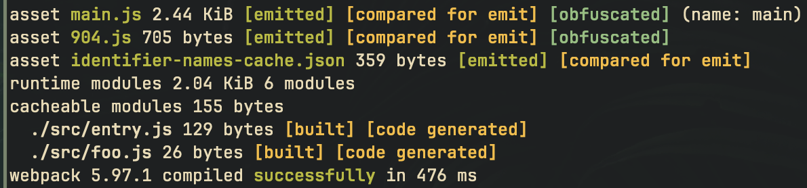

# obfuscator-webpack-plugin

A [webpack](https://webpack.js.org/) plugin for obfuscating JavaScript code
using [javascript-obfuscator](https://github.com/javascript-obfuscator/javascript-obfuscator).

## Overview

This plugin differs from the first-party
[webpack-obfuscator](https://github.com/javascript-obfuscator/webpack-obfuscator)
plugin in the following ways:

- Obfuscation can be done in the optimization phase instead of the emit phase,
  this allows running the obfuscator on the final optimized assets.
- Obfuscated identifier names cache is consistent across the chunks, to
  reduce the chance of breaking code.
- Automatic configuration of the obfuscator for Node.js and browser
  environments with sensible defaults for each that reduce the chance of
  breaking code.
- Initial reserved-keywords preset to reduce the chance of breaking code
  by default.
- Custom `pre` and `post` hooks for allowing customization of the obfuscation
  process per chunk.
- Custom `done` hook for allowing post-processing of the obfuscated assets and
  shared identifier names cache.
- Indicators in the webpack stats output to show which assets were
  obfuscated, for fast visual inspection.

<details>
  <summary>Toggle sample output image</summary>
  
</details>

## Installation

To install the plugin, you can use `npm` or another package manager. Make sure to install the obfuscator package as well.

```sh
npm install -D javascript-obfuscator obfuscator-webpack-plugin
```

## Usage

Add the plugin to the `optimization.minimizer` array in the webpack
configuration:

```js
const { ObfuscatorPlugin } = require("obfuscator-webpack-plugin");

module.exports = {
  optimization: {
    minimize: true,
    minimizer: [
      new ObfuscatorPlugin(),
    ],
  },
};
```

### Options

The plugin accepts an options object with the following properties:

- `assumptions`:
  - `csp` (boolean): Indicates whether
    [Content Security Policy](https://en.wikipedia.org/wiki/Content_Security_Policy)
    is enabled.
  - `hmr` (boolean): Indicates whether
    [Hot Module Replacement](https://webpack.js.org/concepts/hot-module-replacement)
    is enabled.
  - `nodeEnv` (string): Specifies the target environment mode
    (development/production).
  - `target` (string): Specifies the target environment (browser/node).
- `cache` (boolean): Indicates whether to enable caching of the obfuscated
  code.
- `exclude` ((RegExp | string)[]): An array of regular expressions to exclude
  assets from obfuscation.
- `options` (object): The options object to pass to the obfuscator.
- `setupHooks` (function): A function to register hooks for customizing the
  process.
- `stage` (number): Stage at which the plugin will be run
  (default: `PROCESS_ASSETS_STAGE_DEV_TOOLING`).
- `test` ((RegExp | string)[]): An array of regular expressions to include
  assets for obfuscation (default: `/\.[cm]?js[x]?(?:\?.*)?$/iu`).

See the
[javascript-obfuscator documentation](https://github.com/javascript-obfuscator/javascript-obfuscator#javascript-obfuscator-options)
for more information on the options.

This example demonstrates how to specify the obfuscator options:

```js
const { ObfuscatorPlugin } = require("obfuscator-webpack-plugin");

const domain = "example.com";
const domainLockRedirectUrl = `https://${domain}`;

module.exports = {
  optimization: {
    minimize: true,
    minimizer: [
      new ObfuscatorPlugin({
        options: {
          domainLock: [domain],
          domainLockRedirectUrl,
        },
      }),
    ],
  },
};
```

See the following sections for more information on the options.

### Assumptions

The plugin attempts to make intelligent decisions about how to obfuscate the
code, but it may not always make the best choices. The following sections
describe the assumptions the plugin makes and how to override them.

#### Content Security Policy (CSP)

When the `target` option is not defined explicitly and the plugin detects that
the target is a browser environment, it also checks that if a `trusted-types`
policy is specified in the webpack configuration. If so, the plugin configures
the obfuscator to generate code that does not contain `eval` calls.

This behavior can be overridden by setting one of the `csp` or `target`
assumptions explicitly.

#### Hot Module Replacement (HMR)

Unless the `cache` option is defined explicitly, the plugin enables the
caching of the obfuscated codes to reduce build times if the plugin detects
that HMR is enabled.

This behavior can be overridden by setting the `hmr` assumption explicitly.

#### Node environment

The plugin tries to determine if the NODE_ENV is development or production
based on the webpack configuration.

* If the `mode` is set in the configuration, the plugin uses that value to
  determine the mode.
* If the `optimization.nodeEnv` is set, the plugin uses
  that value as the fallback.
* If neither is set, the plugin defaults to `process.env.NODE_ENV || "development"`.

This behavior can be overridden by setting the `nodeEnv` assumption explicitly.

#### Target environment

If the `target` option is not defined explicitly in the obfuscator options,
the plugin tries to determine the target environment based on the webpack
configuration, aiming to define sensible defaults for the obfuscator
accordingly, to reduce the chance of breaking code.

The plugin assumes that the target is a browser environment if one of the
following is true:

* `target` key in the webpack configuration is set to either `web` or `webworker`.
* Either `web` or `webAsync` flag in the `externalsPresets` webpack
  configuration is set to `true`.

The plugin assumes that the target is a Node.js environment if one of the
following is true:
* `target` key in the webpack configuration is set to `node`.
* One of the `node`, `electron`, `electronMain`, `electronPreload`,
  `electronRenderer`, `nwjs` flags in the `externalsPresets` webpack
  configuration is set to `true`.

If none of the above conditions are met, before defaulting to `browser` target,
the plugin checks if any `browserslist` query is provided in the webpack
configuration. If exists, the plugin evaluates the query to determine the target
environments. If the results contain `node`, the plugin chooses `node` as the
target. Otherwise, the choosen value is `browser`.

The `target` assumption can be overridden manually if necessary.

Here is an example of how to override the assumptions:

```js
const { ObfuscatorPlugin } = require("obfuscator-webpack-plugin");

module.exports = {
  optimization: {
    minimize: true,
    minimizer: [
      new ObfuscatorPlugin({
        assumptions: {
          csp: true,
          hmr: false,
          nodeEnv: "production",
          target: "browser-no-eval",
        },
      }),
    ],
  },
};
```

### Cache

Enabling the cache can reduce build times by reusing the obfuscated code from
the previous build. By default, unless the `hmr` assumption is set to `true`,
the `cache` option is disabled.

```js
const { ObfuscatorPlugin } = require("obfuscator-webpack-plugin");

module.exports = {
  optimization: {
    minimize: true,
    minimizer: [
      new ObfuscatorPlugin({
        cache: true,
      }),
    ],
  },
};
```

### Excluding assets

To exclude assets from obfuscation, the `exclude` option can be set to an array
of regular expressions that match the asset names.

```js
const { ObfuscatorPlugin } = require("obfuscator-webpack-plugin");

module.exports = {
  optimization: {
    minimize: true,
    minimizer: [
      new ObfuscatorPlugin({
        exclude: [
          /\.no-obfuscation\.js$/i,
        ]
      }),
    ],
  },
};
```

### Setting up hooks

The plugin provides custom hooks for customizing the obfuscation process per
chunk. The `setupHooks` option can be used to register hooks for customizing
the process.

The `setupHooks` function receives two arguments:

- `compilation` (object): The webpack compilation object.
- `hooks` (object): An object containing the hooks.

The `hooks` object contains the following properties:

- `preObfuscation`: A tapable hook that is called before obfuscation.
- `postObfuscation`: A tapable hook that is called after obfuscation.
- `done`: A tapable hook that is called after all assets are obfuscated.

**Note**: Because of that each compilation will have its own set of hooks,
the provided `setupHooks` function will be called for each compilation.

The following example demonstrates how to use the `setupHooks` option:

```js
const { ObfuscatorPlugin } = require("obfuscator-webpack-plugin");

module.exports = {
  optimization: {
    minimize: true,
    minimizer: [
      new ObfuscatorPlugin({
        setupHooks(
          compilation,
          hooks,
        )
        {
          hooks.preObfuscation.tap(
            // Handler name can be anything,
            // just keep it unique per hook type to avoid conflicts.
            "pre-obfuscation-handler-1",
            (
              assetName,
              obfuscatorOptions,
            ) =>
            {
              // Pre-process the obfuscator options.
              // E.g., customize them per asset.
              obfuscatorOptions.renameGlobals = true;
            },
          );

          hooks.postObfuscation.tap(
            "post-obfuscation-handler-1",
            (
              assetName,
              source,
              sharedIdentifierNamesCache,
            ) =>
            {
              // Post-process the obfuscated source.
            },
          );

          hooks.done.tap(
            "done-handler-1",
            (sharedIdentifierNamesCache) =>
            {
              // Post-process all the obfuscated assets or shared identifier names cache.
              // E.g., dump the shared identifier names cache to a file or memory,
              // then re-use it in the next build by reading it back and passing it
              // to the plugin.
              compilation.emitAsset(
                "identifier-names-cache.json",
                new compilation.compiler.webpack.sources.RawSource(
                  JSON.stringify(
                    sharedIdentifierNamesCache,
                    null,
                    2,
                  ),
                ),
              );
            },
          );
        },
      }),
    ],
  },
};
```

#### Accessing hooks from other plugins

`ObfuscatorPlugin` class provides a public method named as `setupHooks` that
can be used to access the hooks from other plugins.

By design, to avoid memory leaks and other similar issues, the hooks cannot
be accessed directly from the plugin instance. Because the hooks are created
per compilation, and they are not stored in the scope of the plugin instance,
intentionally. The same is also true for the current compilation object. So,
it is necessary to pass the current compilation object to the `setupHooks`
method in order to access the corresponding hooks.

For example, in your plugin's `apply` method, you can access the hooks like
this:

```js
apply(
  compiler,
)
{
  compiler.hooks.compilation.tap(
    PLUGIN_NAME,
    (compilation) =>
    {
      const obfuscatorPlugin = compilation.options.plugins.find(
        (plugin) =>
        {
          return plugin instanceof ObfuscatorPlugin;
        },
      );

      obfuscatorPlugin.setupHooks(
        compilation,
        (hooks) =>
        {
          // Use the hooks here.
        },
      );
    },
  );
}
```

### Using with other minimizers

The plugin can be used in conjunction with other minimizers, such as
[Terser Plugin](https://github.com/webpack-contrib/terser-webpack-plugin).

Example:

```js
const { ObfuscatorPlugin } = require("obfuscator-webpack-plugin");
const TerserPlugin = require("terser-webpack-plugin");

module.exports = {
  optimization: {
    minimize: true,
    minimizer: [
      new TerserPlugin(),
      new ObfuscatorPlugin(),
    ],
  },
};
```

## Examples

The [`e2e`](./e2e) directory in the repository contain sample packages that use
the plugin. As a more sophisticated example,
[`e2e/apps/nextjs`](./e2e/apps/nextjs) basically demonstrates how to use the
plugin with a [Next.js](https://nextjs.org) application where both the server
and client code are obfuscated.

## Troubleshooting

The plugin may not work out of the box for all projects. If the obfuscator
cannot obfuscate the code, the plugin cannot do much about it neither.

If you encounter issues, it could be likely due to the wild nature of the
obfuscation in a dynamic language like JavaScript. For a solution, you may
consider the following steps:

- Tune the obfuscator options to see if that resolves the issue.
- Write your code in a way that is more obfuscation-friendly.
- Disable options that are causing the issue.

**Hints**: It is recommended to keep the `renameGlobals` and `renameProperties`
options as `false` unless you are sure that the code can handle the renaming
of the global variables and properties. You may try setting
`transformObjectKeys` to `true`, since it is less likely to break the code.
However, no guarantees can be given here.

## License

This project is licensed under the
[MIT License](https://opensource.org/license/mit).

See the [LICENSE](LICENSE) file for more information.
